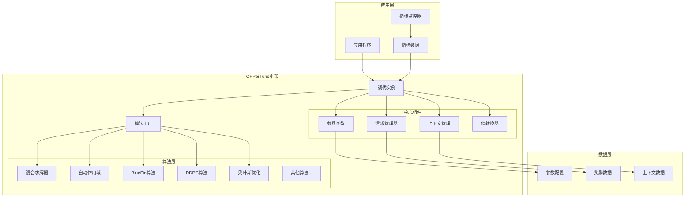
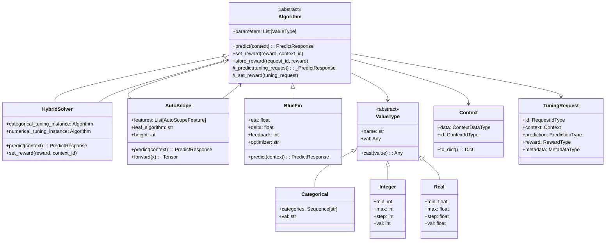
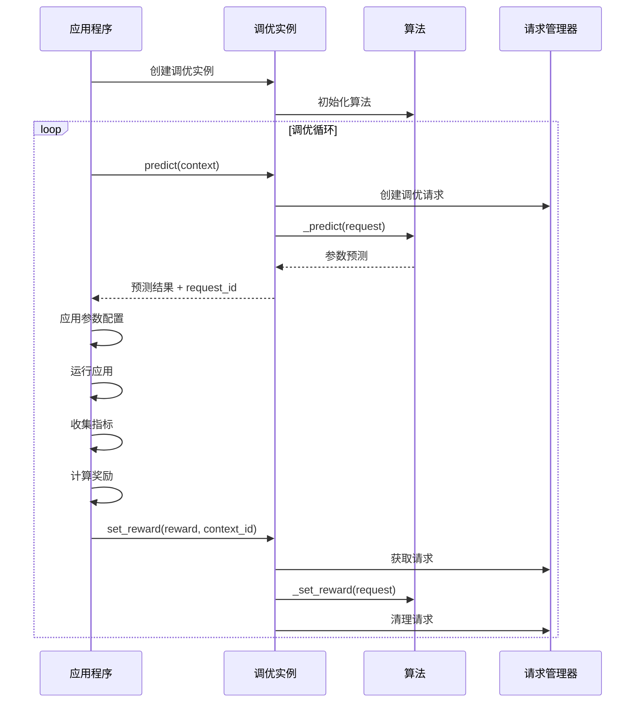
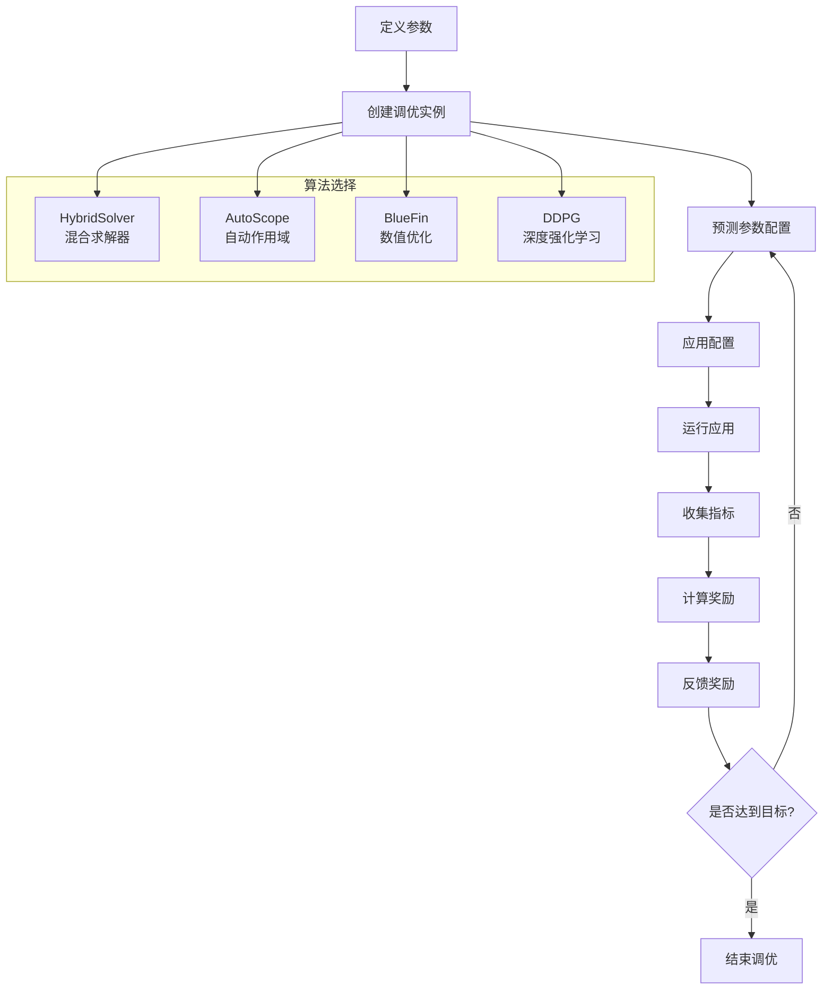

# OPPerTune 技术摘要报告

## 概述

OPPerTune 是一个用于应用程序配置参数调优的强化学习框架，特别适用于生产环境部署。该框架通过自动化配置调优过程，在最小化应用程序中断的同时最大化性能。

## 核心架构

### 高层架构图



### 系统组件关系图



## 核心组件详解

### 1. 参数类型系统

OPPerTune 支持三种核心参数类型：

- **Categorical**: 分类参数，如 "low", "medium", "high"
- **Integer**: 整数参数，带有最小值、最大值和步长
- **Real**: 实数参数，支持连续值调优

### 2. 算法架构

#### 2.1 混合求解器 (HybridSolver)
- 将参数分为分类参数和数值参数
- 分别使用不同的算法进行优化
- 支持组合多种算法的优势

#### 2.2 自动作用域 (AutoScope)
- 基于上下文特征自动确定调优范围
- 使用决策树结构管理不同场景
- 支持动态作用域调整

#### 2.3 BlueFin 算法
- 专门针对数值参数优化
- 支持在线学习和快速收敛
- 提供多种优化器选择

### 3. 上下文管理系统



## 扩展开发指南

### 接入新系统/数据库的开发指南

#### 1. 自定义应用程序接口

要接入新的系统或数据库，需要实现以下接口：

```python
class YourApplication:
    """自定义应用程序类"""
    
    def set_parameters(self, parameters: Mapping[str, Any]):
        """设置配置参数"""
        # 实现参数设置逻辑
        # 例如：更新数据库连接池大小、缓存策略等
        pass
    
    def run(self):
        """运行应用程序"""
        # 实现应用程序执行逻辑
        pass

class YourMetricsMonitor:
    """自定义指标监控器"""
    
    def start(self):
        """开始监控指标"""
        # 实现监控启动逻辑
        pass
    
    def stop(self) -> YourMetrics:
        """停止监控并返回指标"""
        # 实现监控停止和指标收集逻辑
        pass

class YourMetrics:
    """自定义指标数据结构"""
    
    def __init__(self, throughput: float, latency: float, error_rate: float):
        self.throughput = throughput
        self.latency = latency
        self.error_rate = error_rate
```

#### 2. 奖励函数设计

根据你的业务目标设计奖励函数：

```python
def calculate_reward(metrics: YourMetrics) -> float:
    """计算奖励值"""
    # 示例：平衡吞吐量、延迟和错误率
    base_reward = metrics.throughput / (metrics.latency + 1e-6)
    
    # 惩罚高错误率
    error_penalty = 1.0 - metrics.error_rate
    
    # 组合奖励
    reward = base_reward * error_penalty
    
    # 标准化到 [0, 1] 范围
    max_possible_reward = 1000.0  # 根据实际情况调整
    return min(reward / max_possible_reward, 1.0)
```

#### 3. 参数定义

定义需要调优的参数：

```python
# 数据库参数示例
parameters = [
    Integer(name="connection_pool_size", val=10, min=5, max=100),
    Real(name="cache_hit_ratio", val=0.8, min=0.1, max=0.95),
    Categorical(name="consistency_level", val="eventual", 
                categories=("strong", "eventual", "weak")),
    Integer(name="batch_size", val=1000, min=100, max=10000, step=100),
]
```

#### 4. 上下文特征

如果使用 AutoScope，定义上下文特征：

```python
# 工作负载特征示例
features = [
    AutoScopeFeature(name="workload_type", values=("oltp", "olap", "mixed")),
    AutoScopeFeature(name="time_of_day", values=("morning", "afternoon", "evening")),
    AutoScopeFeature(name="user_load", values=("light", "medium", "heavy")),
]
```

### 改进调优算法的开发指南

#### 1. 实现新算法

创建新的算法类，继承 `Algorithm` 基类：

```python
from oppertune.algorithms.base import Algorithm, _PredictResponse, _TuningRequest
from oppertune.core.types import PredictResponse
from oppertune.core.values import Integer, Real
from typing import Iterable, Union

class YourCustomAlgorithm(Algorithm):
    class Meta:
        supported_parameter_types = (Integer, Real)  # 支持的参数类型
        requires_untransformed_parameters = False
        supports_context = True  # 是否支持上下文
        supports_single_reward = True
        supports_sequence_of_rewards = False
    
    def __init__(self, parameters: Iterable[Union[Integer, Real]], 
                 custom_param: float = 0.1, **kwargs):
        super().__init__(parameters, **kwargs)
        self.custom_param = custom_param
        # 初始化算法特定的状态
        self._initialize_algorithm_state()
    
    def _initialize_algorithm_state(self):
        """初始化算法状态"""
        # 实现算法特定的初始化逻辑
        pass
    
    def _predict(self, tuning_request: _TuningRequest) -> _PredictResponse:
        """实现预测逻辑"""
        # 获取当前参数值
        current_params = {p.name: p.val for p in self.params}
        
        # 实现你的预测算法
        predicted_params = self._your_prediction_logic(
            current_params, tuning_request.context
        )
        
        return _PredictResponse(prediction=predicted_params)
    
    def _set_reward(self, tuning_request: _TuningRequest) -> None:
        """实现奖励处理逻辑"""
        # 使用奖励更新算法状态
        self._update_algorithm_state(tuning_request.reward)
    
    def _your_prediction_logic(self, current_params, context):
        """自定义预测逻辑"""
        # 实现算法核心逻辑
        pass
    
    def _update_algorithm_state(self, reward):
        """更新算法状态"""
        # 根据奖励更新算法内部状态
        pass
```

#### 2. 注册新算法

在 `oppertune/algorithms/all.py` 中注册新算法：

```python
from .your_custom_algorithm import YourCustomAlgorithm

ALGORITHMS: Dict[str, Type[Algorithm]] = {
    # ... 现有算法
    "your_custom_algorithm": YourCustomAlgorithm,
}
```

#### 3. 算法开发最佳实践

1. **状态管理**: 正确维护算法内部状态
2. **参数验证**: 在 `__init__` 中验证参数
3. **异常处理**: 处理边界情况和异常
4. **文档**: 提供清晰的文档和示例
5. **测试**: 编写单元测试和集成测试

#### 4. 现有算法改进位置

- **BlueFin算法**: `oppertune-algorithms/src/oppertune/algorithms/bluefin/bluefin.py`
- **AutoScope算法**: `oppertune-algorithms/src/oppertune/algorithms/autoscope/autoscope.py`
- **混合求解器**: `oppertune-algorithms/src/oppertune/algorithms/hybrid_solver/hybrid_solver.py`
- **DDPG算法**: `oppertune-algorithms/src/oppertune/algorithms/ddpg/ddpg.py`

## 调优流程



## 使用示例

### 基本使用

```python
from oppertune.algorithms.hybrid_solver import HybridSolver
from oppertune.core.values import Categorical, Integer, Real

# 1. 定义参数
parameters = [
    Categorical(name="algorithm", val="fast", categories=("fast", "accurate")),
    Integer(name="workers", val=4, min=1, max=16),
    Real(name="learning_rate", val=0.01, min=0.001, max=0.1),
]

# 2. 创建调优实例
tuning_instance = HybridSolver(
    parameters,
    categorical_algorithm="exponential_weights_slates",
    numerical_algorithm="bluefin",
    categorical_algorithm_args={"random_seed": 123},
    numerical_algorithm_args={"eta": 0.01, "delta": 0.1},
)

# 3. 调优循环
for iteration in range(100):
    # 预测参数
    prediction, request_id = tuning_instance.predict()
    
    # 应用参数并运行
    app.set_parameters(prediction)
    metrics = app.run_and_collect_metrics()
    
    # 计算奖励
    reward = calculate_reward(metrics)
    
    # 反馈奖励
    tuning_instance.set_reward(reward)
    
    if reward >= 0.95:  # 达到目标
        break
```

### 使用 AutoScope 进行上下文感知调优

```python
from oppertune.algorithms.autoscope import AutoScope, AutoScopeFeature

# 定义上下文特征
features = [
    AutoScopeFeature(name="workload", values=("light", "medium", "heavy")),
    AutoScopeFeature(name="time_of_day", values=("morning", "afternoon", "evening")),
]

# 创建 AutoScope 实例
autoscope = AutoScope(
    parameters=parameters,
    features=features,
    leaf_algorithm="bluefin",
    height=3,
    eta=0.001,
)

# 使用上下文进行预测
context = Context({"workload": "heavy", "time_of_day": "morning"})
prediction, request_id = autoscope.predict(context)
```

## 技术特点

1. **模块化设计**: 清晰的算法抽象和组件分离
2. **算法多样性**: 支持多种优化算法
3. **上下文感知**: 支持基于场景的自动调优
4. **混合优化**: 同时处理分类和数值参数
5. **生产就绪**: 支持在线学习和实时调优

## 总结

OPPerTune 提供了一个完整的配置参数调优框架，具有良好的扩展性和实用性。开发者可以通过实现自定义的应用程序接口和奖励函数来接入新系统，同时可以通过继承 `Algorithm` 基类来开发新的调优算法。框架的模块化设计使得各个组件可以独立开发和测试，为生产环境的配置调优提供了强大的支持。