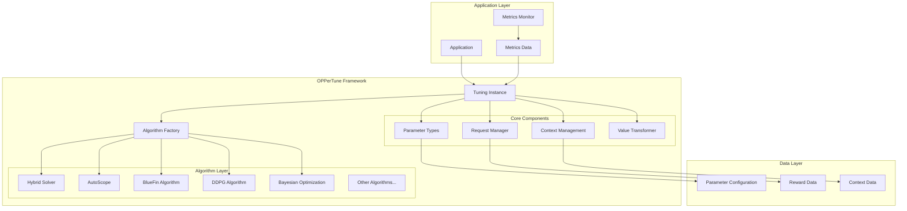
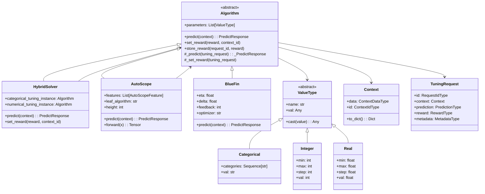
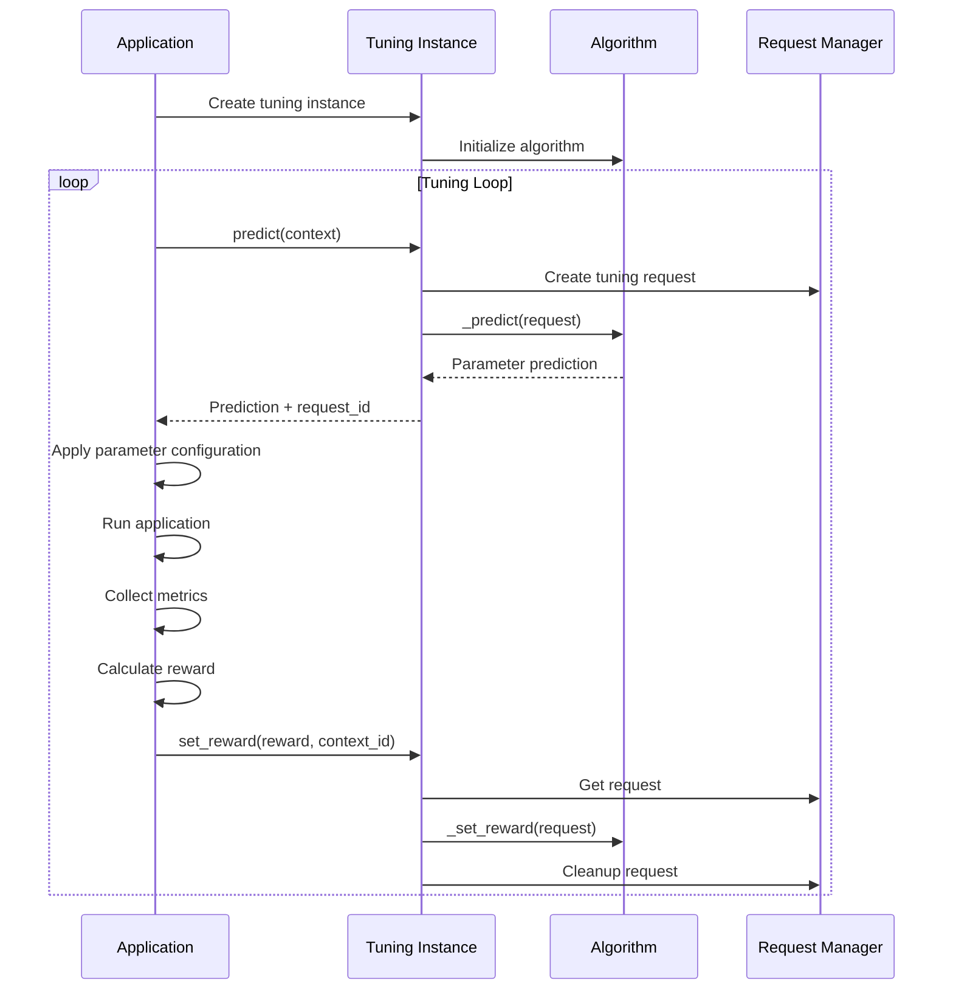
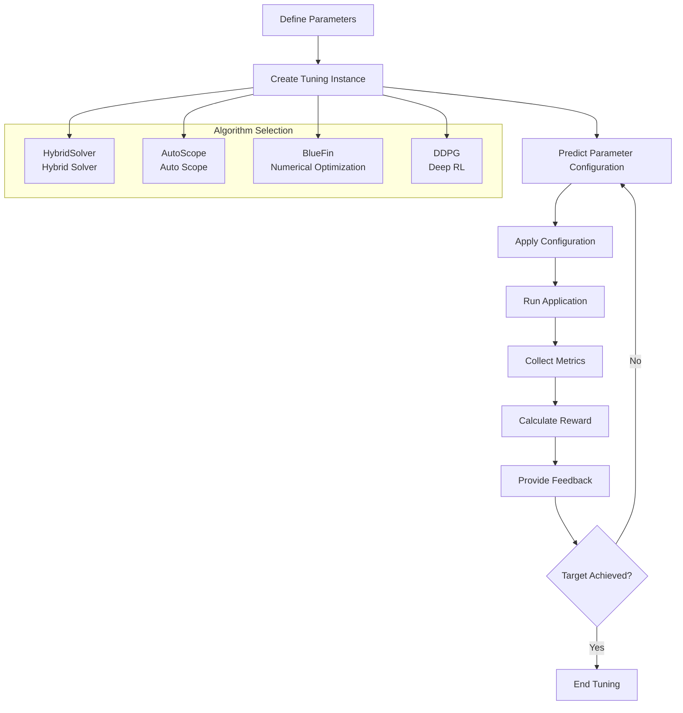

# OPPerTune Technical Summary Report

## Overview

OPPerTune is a reinforcement learning framework designed for configuration parameter tuning of applications, particularly suitable for production deployment environments. The framework automates the configuration tuning process while minimizing application interruptions and maximizing performance.

## Core Architecture

### High-Level Architecture Diagram



### System Component Relationships



## Core Components

### 1. Parameter Type System

OPPerTune supports three core parameter types:

- **Categorical**: Discrete choice parameters, e.g., "low", "medium", "high"
- **Integer**: Integer parameters with min, max, and step constraints
- **Real**: Continuous real-valued parameters

### 2. Algorithm Architecture

#### 2.1 Hybrid Solver
- Separates parameters into categorical and numerical types
- Uses different algorithms for each type
- Combines the strengths of multiple optimization approaches

#### 2.2 AutoScope
- Automatically determines tuning scope based on context features
- Uses decision tree structure to manage different scenarios
- Supports dynamic scope adjustment

#### 2.3 BlueFin Algorithm
- Specialized for numerical parameter optimization
- Supports online learning and fast convergence
- Provides multiple optimizer options

### 3. Context Management System



## Extension Development Guide

### Integration with New Systems/Databases

#### 1. Custom Application Interface

To integrate with new systems or databases, implement the following interfaces:

```python
class YourApplication:
    """Custom application class"""
    
    def set_parameters(self, parameters: Mapping[str, Any]):
        """Set configuration parameters"""
        # Implement parameter setting logic
        # e.g., update database connection pool size, cache strategy, etc.
        pass
    
    def run(self):
        """Run the application"""
        # Implement application execution logic
        pass

class YourMetricsMonitor:
    """Custom metrics monitor"""
    
    def start(self):
        """Start monitoring metrics"""
        # Implement monitoring start logic
        pass
    
    def stop(self) -> YourMetrics:
        """Stop monitoring and return metrics"""
        # Implement monitoring stop and metrics collection logic
        pass

class YourMetrics:
    """Custom metrics data structure"""
    
    def __init__(self, throughput: float, latency: float, error_rate: float):
        self.throughput = throughput
        self.latency = latency
        self.error_rate = error_rate
```

#### 2. Reward Function Design

Design reward functions based on your business objectives:

```python
def calculate_reward(metrics: YourMetrics) -> float:
    """Calculate reward value"""
    # Example: balance throughput, latency, and error rate
    base_reward = metrics.throughput / (metrics.latency + 1e-6)
    
    # Penalize high error rates
    error_penalty = 1.0 - metrics.error_rate
    
    # Combine rewards
    reward = base_reward * error_penalty
    
    # Normalize to [0, 1] range
    max_possible_reward = 1000.0  # Adjust based on actual scenario
    return min(reward / max_possible_reward, 1.0)
```

#### 3. Parameter Definition

Define parameters to be tuned:

```python
# Database parameter examples
parameters = [
    Integer(name="connection_pool_size", val=10, min=5, max=100),
    Real(name="cache_hit_ratio", val=0.8, min=0.1, max=0.95),
    Categorical(name="consistency_level", val="eventual", 
                categories=("strong", "eventual", "weak")),
    Integer(name="batch_size", val=1000, min=100, max=10000, step=100),
]
```

#### 4. Context Features

If using AutoScope, define context features:

```python
# Workload feature examples
features = [
    AutoScopeFeature(name="workload_type", values=("oltp", "olap", "mixed")),
    AutoScopeFeature(name="time_of_day", values=("morning", "afternoon", "evening")),
    AutoScopeFeature(name="user_load", values=("light", "medium", "heavy")),
]
```

### Algorithm Development Guide

#### 1. Implementing New Algorithms

Create new algorithm classes by inheriting from the `Algorithm` base class:

```python
from oppertune.algorithms.base import Algorithm, _PredictResponse, _TuningRequest
from oppertune.core.types import PredictResponse
from oppertune.core.values import Integer, Real
from typing import Iterable, Union

class YourCustomAlgorithm(Algorithm):
    class Meta:
        supported_parameter_types = (Integer, Real)  # Supported parameter types
        requires_untransformed_parameters = False
        supports_context = True  # Whether context is supported
        supports_single_reward = True
        supports_sequence_of_rewards = False
    
    def __init__(self, parameters: Iterable[Union[Integer, Real]], 
                 custom_param: float = 0.1, **kwargs):
        super().__init__(parameters, **kwargs)
        self.custom_param = custom_param
        # Initialize algorithm-specific state
        self._initialize_algorithm_state()
    
    def _initialize_algorithm_state(self):
        """Initialize algorithm state"""
        # Implement algorithm-specific initialization logic
        pass
    
    def _predict(self, tuning_request: _TuningRequest) -> _PredictResponse:
        """Implement prediction logic"""
        # Get current parameter values
        current_params = {p.name: p.val for p in self.params}
        
        # Implement your prediction algorithm
        predicted_params = self._your_prediction_logic(
            current_params, tuning_request.context
        )
        
        return _PredictResponse(prediction=predicted_params)
    
    def _set_reward(self, tuning_request: _TuningRequest) -> None:
        """Implement reward handling logic"""
        # Use reward to update algorithm state
        self._update_algorithm_state(tuning_request.reward)
    
    def _your_prediction_logic(self, current_params, context):
        """Custom prediction logic"""
        # Implement core algorithm logic
        pass
    
    def _update_algorithm_state(self, reward):
        """Update algorithm state"""
        # Update algorithm internal state based on reward
        pass
```

#### 2. Registering New Algorithms

Register new algorithms in `oppertune/algorithms/all.py`:

```python
from .your_custom_algorithm import YourCustomAlgorithm

ALGORITHMS: Dict[str, Type[Algorithm]] = {
    # ... existing algorithms
    "your_custom_algorithm": YourCustomAlgorithm,
}
```

#### 3. Algorithm Development Best Practices

1. **State Management**: Properly maintain algorithm internal state
2. **Parameter Validation**: Validate parameters in `__init__`
3. **Exception Handling**: Handle edge cases and exceptions
4. **Documentation**: Provide clear documentation and examples
5. **Testing**: Write unit tests and integration tests

#### 4. Existing Algorithm Improvement Locations

- **BlueFin Algorithm**: `oppertune-algorithms/src/oppertune/algorithms/bluefin/bluefin.py`
- **AutoScope Algorithm**: `oppertune-algorithms/src/oppertune/algorithms/autoscope/autoscope.py`
- **Hybrid Solver**: `oppertune-algorithms/src/oppertune/algorithms/hybrid_solver/hybrid_solver.py`
- **DDPG Algorithm**: `oppertune-algorithms/src/oppertune/algorithms/ddpg/ddpg.py`

## Tuning Process Flow



## Usage Examples

### Basic Usage

```python
from oppertune.algorithms.hybrid_solver import HybridSolver
from oppertune.core.values import Categorical, Integer, Real

# 1. Define parameters
parameters = [
    Categorical(name="algorithm", val="fast", categories=("fast", "accurate")),
    Integer(name="workers", val=4, min=1, max=16),
    Real(name="learning_rate", val=0.01, min=0.001, max=0.1),
]

# 2. Create tuning instance
tuning_instance = HybridSolver(
    parameters,
    categorical_algorithm="exponential_weights_slates",
    numerical_algorithm="bluefin",
    categorical_algorithm_args={"random_seed": 123},
    numerical_algorithm_args={"eta": 0.01, "delta": 0.1},
)

# 3. Tuning loop
for iteration in range(100):
    # Predict parameters
    prediction, request_id = tuning_instance.predict()
    
    # Apply parameters and run
    app.set_parameters(prediction)
    metrics = app.run_and_collect_metrics()
    
    # Calculate reward
    reward = calculate_reward(metrics)
    
    # Provide feedback
    tuning_instance.set_reward(reward)
    
    if reward >= 0.95:  # Target achieved
        break
```

### Context-Aware Tuning with AutoScope

```python
from oppertune.algorithms.autoscope import AutoScope, AutoScopeFeature

# Define context features
features = [
    AutoScopeFeature(name="workload", values=("light", "medium", "heavy")),
    AutoScopeFeature(name="time_of_day", values=("morning", "afternoon", "evening")),
]

# Create AutoScope instance
autoscope = AutoScope(
    parameters=parameters,
    features=features,
    leaf_algorithm="bluefin",
    height=3,
    eta=0.001,
)

# Use context for prediction
context = Context({"workload": "heavy", "time_of_day": "morning"})
prediction, request_id = autoscope.predict(context)
```

## Key Features

1. **Modular Design**: Clear algorithm abstraction and component separation
2. **Algorithm Diversity**: Support for multiple optimization algorithms
3. **Context Awareness**: Support for scenario-based automatic tuning
4. **Hybrid Optimization**: Simultaneous handling of categorical and numerical parameters
5. **Production Ready**: Support for online learning and real-time tuning

## Summary

OPPerTune provides a comprehensive configuration parameter tuning framework with excellent extensibility and practicality. Developers can integrate new systems by implementing custom application interfaces and reward functions, while new tuning algorithms can be developed by inheriting from the `Algorithm` base class. The framework's modular design allows independent development and testing of components, providing robust support for production environment configuration tuning.

## Development and Testing

### Running Tests

```bash
cd oppertune-algorithms
python -m pytest tests/
```

### Code Style

The project uses `ruff` for code formatting:

```bash
pip install ruff
ruff check
ruff format
```

### Contributing

1. Fork the repository
2. Create a feature branch
3. Implement your changes
4. Add tests for new functionality
5. Run tests and ensure code quality
6. Submit a pull request

This framework provides the foundation for efficient, automated parameter tuning in production environments while maintaining flexibility for custom implementations and extensions.